# HereticSheets DB Entity Tree

Source: `data/heretic_db.sqlite`, `metadata.dataVersion = 879`.

The database contains 145 tables. The tree below treats an edge as "contains" when the child table is owned by the parent in practice: usually a required `ON DELETE CASCADE` foreign key, with manual correction for obvious lookup/reference cases.

Legend:

- Solid arrows: ownership / containment.
- Dashed arrows: important reference to a shared catalog entity.
- Numbers in labels are current row counts in the SQLite snapshot.

```mermaid
flowchart TD
  db["HereticSheets SQLite\n145 tables"]

  db --> catalog["Army catalog"]
  db --> rosterRoot["Roster builder state"]
  db --> missionRoot["Missions and battles"]
  db --> lookupRoot["Shared lookup libraries"]
  db --> technicalRoot["Technical / local tables"]

  catalog --> faction_keyword["faction_keyword\n43"]
  faction_keyword --> faction_keyword_child["faction_keyword.parentFactionKeywordId\nself hierarchy"]
  faction_keyword --> publication["publication\n69"]
  faction_keyword --> keyword_restriction_group["keyword_restriction_group\n16"]
  keyword_restriction_group --> keyword_restriction_group_keyword["keyword_restriction_group_keyword\n21"]
  keyword_restriction_group --> restriction_group_detachment_limit["restriction_group_detachment_limit\n7"]
  faction_keyword --> faction_keyword_allied_faction["faction_keyword_allied_faction\n87"]
  faction_keyword --> faction_keyword_excluded_datasheet["faction_keyword_excluded_datasheet\n23"]
  faction_keyword --> faction_keyword_mandatory_allegiance_ability["faction_keyword_mandatory_allegiance_ability\n0"]
  restriction_group_detachment_limit -. detachment scope .-> detachment

  publication --> datasheet["datasheet\n1,142"]
  publication --> detachment["detachment\n290"]
  publication --> army_rule["army_rule\n98"]
  publication --> enhancement["enhancement\n957"]
  publication --> stratagem["stratagem\n1,432"]
  publication --> faq["faq\n728"]
  publication --> rule_section["rule_section\n33"]
  publication --> objective["objective\n0"]
  publication --> secondary_objective["secondary_objective\n0"]

  rule_section --> rule_section_child["rule_section.parentId\nself hierarchy"]
  rule_section --> rule_container["rule_container\n399"]
  rule_container --> rule_container_component["rule_container_component\n1,791"]
  rule_container_component --> bullet_point["bullet_point\n3"]

  army_rule --> army_rule_behaviour_type["army_rule_behaviour_type\n0"]
  army_rule --> army_rule_faction_keyword["army_rule_faction_keyword\n71"]
  army_rule --> army_rule_excluded_from_command_bunker_faction_keyword["army_rule_excluded_from_command_bunker_faction_keyword\n37"]

  detachment --> detachment_rule["detachment_rule\n306"]
  detachment --> detachment_detail["detachment_detail\n55"]
  detachment_detail --> detachment_detail_bullet_point["detachment_detail_bullet_point\n64"]
  detachment --> allegiance_ability_group["allegiance_ability_group\n10"]
  allegiance_ability_group --> allegiance_ability["allegiance_ability\n26"]
  detachment --> detachment_faction_keyword["detachment_faction_keyword\n457"]
  detachment --> detachment_faction_detachment_points_cost["detachment_faction_detachment_points_cost\n4"]
  detachment --> detachment_force_disposition["detachment_force_disposition\n290"]
  detachment --> detachment_excluded_datasheet["detachment_excluded_datasheet\n23"]
  detachment --> detachment_required_datasheet["detachment_required_datasheet\n0"]
  detachment --> detachment_linked_datasheet["detachment_linked_datasheet\n107"]
  detachment --> detachment_unique_keyword["detachment_unique_keyword\n57"]
  detachment --> detachment_granted_warlord_miniature["detachment_granted_warlord_miniature\n1"]
  detachment --> detachment_mandatory_warlord_miniature["detachment_mandatory_warlord_miniature\n2"]

  detachment --> allied_faction["allied_faction\n21"]
  allied_faction --> allied_faction_keyword["allied_faction_keyword\n54"]
  allied_faction_keyword --> allied_faction_keyword_slotless_keyword_group["allied_faction_keyword_slotless_keyword_group\n12"]
  allied_faction_keyword_slotless_keyword_group --> allied_faction_keyword_slotless_keyword_group_donor_keyword["allied_faction_keyword_slotless_keyword_group_donor_keyword\n18"]
  allied_faction_keyword_slotless_keyword_group --> allied_faction_keyword_slotless_keyword_group_receiver_keyword["allied_faction_keyword_slotless_keyword_group_receiver_keyword\n12"]
  allied_faction --> allied_faction_datasheet["allied_faction_datasheet\n320"]
  allied_faction --> allied_faction_parent_faction_keyword["allied_faction_parent_faction_keyword\n25"]
  allied_faction --> allied_faction_points_limit["allied_faction_points_limit\n39"]
  allied_faction --> allied_faction_required_detachment["allied_faction_required_detachment\n29"]
  allied_faction --> allied_faction_allowed_warlord_miniature["allied_faction_allowed_warlord_miniature\n28"]
  allied_faction --> allied_faction_allegiance_ability["allied_faction_allegiance_ability\n0"]

  datasheet --> miniature["miniature\n1,569"]
  datasheet --> datasheet_rule["datasheet_rule\n525"]
  datasheet --> datasheet_damage["datasheet_damage\n243"]
  datasheet --> datasheet_points_step["datasheet_points_step\n334"]
  datasheet --> invulnerable_save["invulnerable_save\n641"]
  datasheet --> wargear_rule["wargear_rule\n1,366"]
  datasheet --> datasheet_bodyguard_group["datasheet_bodyguard_group\n1,266"]
  datasheet_bodyguard_group --> datasheet_bodyguard_group_datasheet["datasheet_bodyguard_group_datasheet\n1,260"]
  datasheet_bodyguard_group --> datasheet_bodyguard_group_keyword["datasheet_bodyguard_group_keyword\n14"]
  datasheet --> datasheet_faction_keyword["datasheet_faction_keyword\n1,256"]
  datasheet --> datasheet_datasheet_ability["datasheet_datasheet_ability\n4,310"]
  datasheet --> conditional_keyword["conditional_keyword\n380"]

  datasheet --> unit_composition["unit_composition\n1,516"]
  unit_composition --> unit_composition_miniature["unit_composition_miniature\n2,258"]
  unit_composition --> unit_composition_required_detachment["unit_composition_required_detachment\n8"]
  unit_composition --> unit_composition_required_faction_keyword["unit_composition_required_faction_keyword\n51"]

  datasheet --> wargear_option_group["wargear_option_group\n3,025"]
  wargear_option_group --> wargear_option["wargear_option\n6,322"]

  datasheet --> loadout_choice_set["loadout_choice_set\n2,445"]
  loadout_choice_set --> loadout_choice["loadout_choice\n5,374"]
  loadout_choice --> loadout_choice_wargear_item["loadout_choice_wargear_item\n8,325"]

  datasheet --> limited_wargear_choice_set["limited_wargear_choice_set\n343"]
  limited_wargear_choice_set --> limited_wargear_choice["limited_wargear_choice\n569"]
  limited_wargear_choice --> limited_wargear_choice_wargear_item["limited_wargear_choice_wargear_item\n676"]
  limited_wargear_choice_set --> wargear_limit["wargear_limit\n492"]

  datasheet --> all_model_wargear_choice_set["all_model_wargear_choice_set\n28"]
  all_model_wargear_choice_set --> all_model_wargear_choice["all_model_wargear_choice\n63"]
  all_model_wargear_choice --> all_model_wargear_choice_wargear_item["all_model_wargear_choice_wargear_item\n69"]

  miniature --> miniature_keyword["miniature_keyword\n8,773"]
  miniature --> base_miniature_loadout["base_miniature_loadout\n1,300"]
  base_miniature_loadout --> base_miniature_loadout_wargear_option["base_miniature_loadout_wargear_option\n3,132"]

  enhancement --> enhancement_bodyguard_group["enhancement_bodyguard_group\n19"]
  enhancement_bodyguard_group --> enhancement_bodyguard_group_datasheet["enhancement_bodyguard_group_datasheet\n19"]
  enhancement_bodyguard_group --> enhancement_bodyguard_group_keyword["enhancement_bodyguard_group_keyword\n0"]
  enhancement --> enhancement_required_keyword_group["enhancement_required_keyword_group\n1,027"]
  enhancement_required_keyword_group --> enhancement_required_keyword_group_faction_keyword["enhancement_required_keyword_group_faction_keyword\n639"]
  enhancement_required_keyword_group --> enhancement_required_keyword_group_keyword["enhancement_required_keyword_group_keyword\n670"]
  enhancement --> enhancement_datasheet_ability["enhancement_datasheet_ability\n6"]
  enhancement --> enhancement_excluded_keyword["enhancement_excluded_keyword\n32"]
  enhancement --> enhancement_keyword_points_cost["enhancement_keyword_points_cost\n0"]
  enhancement --> enhancement_required_wargear_item["enhancement_required_wargear_item\n1"]
  enhancement --> enhancement_wargear_item_profile["enhancement_wargear_item_profile\n1"]

  stratagem --> stratagem_phase["stratagem_phase\n2,009"]
  faq --> faq_config["faq_config\n986"]

  rosterRoot --> roster["roster\n4"]
  roster --> roster_detachment["roster_detachment\n6"]
  roster --> roster_unit["roster_unit\n2"]
  roster --> roster_attached_unit["roster_attached_unit\n0"]
  roster --> roster_validation_state["roster_validation_state\n4\n(no FK, rosterId PK)"]
  roster_attached_unit --> roster_attached_unit_roster_unit["roster_attached_unit_roster_unit\n0"]
  roster_unit --> roster_unit_miniature["roster_unit_miniature\n2"]
  roster_unit --> roster_unit_wargear_option["roster_unit_wargear_option\n0"]
  roster_unit --> roster_unit_allegiance_ability["roster_unit_allegiance_ability\n0"]
  roster_unit --> roster_unit_enhancement["roster_unit_enhancement\n0"]
  roster_unit_miniature --> roster_unit_miniature_wargear_option["roster_unit_miniature_wargear_option\n4"]
  roster_unit_miniature --> roster_unit_miniature_enhancement["roster_unit_miniature_enhancement\n0"]

  missionRoot --> mission_pack["mission_pack\n2"]
  mission_pack --> mission_deployment["mission_deployment\n9"]
  mission_pack --> mission_layout["mission_layout\n46"]
  mission_layout --> mission_layout_linked_deployment["mission_layout_linked_deployment\n45"]
  mission_pack --> mission_preset["mission_preset\n48"]
  mission_pack --> mission_twist["mission_twist\n6"]
  mission_pack --> primary_mission["primary_mission\n49"]
  primary_mission --> primary_mission_action["primary_mission_action\n13"]
  primary_mission --> primary_mission_objective["primary_mission_objective\n124"]
  primary_mission_objective --> primary_mission_objective_scorable_period["primary_mission_objective_scorable_period\n441"]
  primary_mission_objective --> primary_mission_objective_scoring["primary_mission_objective_scoring\n166"]
  mission_pack --> secondary_mission["secondary_mission\n18"]
  secondary_mission --> secondary_mission_action["secondary_mission_action\n2"]
  secondary_mission --> secondary_mission_objective["secondary_mission_objective\n19"]
  secondary_mission_objective --> secondary_mission_objective_scorable_period["secondary_mission_objective_scorable_period\n0"]
  secondary_mission_objective --> secondary_mission_objective_scoring["secondary_mission_objective_scoring\n31"]
  secondary_mission --> secondary_mission_restricted_secondary_mission["secondary_mission_restricted_secondary_mission\n0"]

  missionRoot --> battle["battle\n1"]
  battle --> battle_player["battle_player\n2"]
  battle_player --> battle_player_detachment["battle_player_detachment\n2"]
  battle_player --> battle_player_secondary_mission["battle_player_secondary_mission\n0"]
  battle_player --> battle_player_turn["battle_player_turn\n10"]
  battle_player_turn --> battle_player_turn_scored_primary["battle_player_turn_scored_primary\n0"]
  battle_player_turn --> battle_player_turn_scored_secondary["battle_player_turn_scored_secondary\n0"]

  missionRoot --> force_disposition["force_disposition\n5"]
  force_disposition --> force_disposition_mission["force_disposition_mission\n25"]
  force_disposition_mission --> force_disposition_mission_recommended_preset["force_disposition_mission_recommended_preset\n75"]

  lookupRoot --> keyword["keyword\n1,239"]
  keyword --> keyword_child["keyword.allyRestrictingKeywordId\nself hierarchy"]
  keyword --> keyword_ally_restricting_keyword["keyword_ally_restricting_keyword\n0"]
  lookupRoot --> datasheet_ability["datasheet_ability\n2,025"]
  datasheet_ability --> datasheet_sub_ability["datasheet_sub_ability\n52"]
  lookupRoot --> wargear_item["wargear_item\n3,516"]
  wargear_item --> wargear_item_profile["wargear_item_profile\n3,712"]
  wargear_item_profile --> wargear_item_profile_wargear_ability["wargear_item_profile_wargear_ability\n4,218"]
  lookupRoot --> wargear_ability["wargear_ability\n121"]
  lookupRoot --> behaviour_type["behaviour_type\n19"]
  lookupRoot --> battle_size["battle_size\n3"]

  technicalRoot --> metadata["metadata\n1"]
  technicalRoot --> grdb_migrations["grdb_migrations\n33"]
  technicalRoot --> entitlement["entitlement\n0"]
  technicalRoot --> favourite["favourite\n0"]

  roster -. selected faction .-> faction_keyword
  roster -. size .-> battle_size
  roster_detachment -. detachment .-> detachment
  roster_unit -. source unit .-> datasheet
  roster_unit_miniature -. source model .-> miniature
  roster_unit_wargear_option -. option .-> wargear_option
  roster_unit_miniature_wargear_option -. option .-> wargear_option
  roster_unit_enhancement -. enhancement .-> enhancement
  roster_unit_miniature_enhancement -. enhancement .-> enhancement
  datasheet_datasheet_ability -. ability .-> datasheet_ability
  miniature_keyword -. keyword .-> keyword
  wargear_option -. item .-> wargear_item
  loadout_choice_wargear_item -. item .-> wargear_item
  limited_wargear_choice_wargear_item -. item .-> wargear_item
  all_model_wargear_choice_wargear_item -. item .-> wargear_item
  wargear_item_profile_wargear_ability -. ability .-> wargear_ability
  rule_container -. behaviour .-> behaviour_type
  faq_config -. attaches FAQ to catalog objects .-> datasheet
  faq_config -. attaches FAQ to catalog objects .-> detachment
  faq_config -. attaches FAQ to catalog objects .-> enhancement
  faq_config -. attaches FAQ to catalog objects .-> stratagem
```



## Main Hierarchies

Catalog:

```text
faction_keyword
  publication
    datasheet
      miniature
        miniature_keyword -> keyword
        base_miniature_loadout
          base_miniature_loadout_wargear_option -> wargear_option
      unit_composition
        unit_composition_miniature -> miniature
        unit_composition_required_detachment -> detachment
        unit_composition_required_faction_keyword -> faction_keyword
      wargear_option_group
        wargear_option -> wargear_item
      loadout_choice_set
        loadout_choice
          loadout_choice_wargear_item -> wargear_item
      limited_wargear_choice_set
        limited_wargear_choice
          limited_wargear_choice_wargear_item -> wargear_item
        wargear_limit
      all_model_wargear_choice_set
        all_model_wargear_choice
          all_model_wargear_choice_wargear_item -> wargear_item
      datasheet_rule
      datasheet_damage
      datasheet_points_step
      invulnerable_save
      wargear_rule
      datasheet_bodyguard_group
        datasheet_bodyguard_group_datasheet -> datasheet
        datasheet_bodyguard_group_keyword -> keyword
    detachment
      detachment_rule
      detachment_detail
        detachment_detail_bullet_point
      allegiance_ability_group
        allegiance_ability
      allied_faction
        allied_faction_keyword
          allied_faction_keyword_slotless_keyword_group
            allied_faction_keyword_slotless_keyword_group_donor_keyword -> keyword
            allied_faction_keyword_slotless_keyword_group_receiver_keyword -> keyword
        allied_faction_datasheet -> datasheet
        allied_faction_points_limit -> battle_size
        allied_faction_required_detachment -> detachment
        allied_faction_allowed_warlord_miniature -> miniature
      detachment_* join/restriction tables -> datasheet, keyword, faction_keyword, miniature, force_disposition
    enhancement
      enhancement_required_keyword_group
        enhancement_required_keyword_group_keyword -> keyword
        enhancement_required_keyword_group_faction_keyword -> faction_keyword
      enhancement_bodyguard_group
        enhancement_bodyguard_group_datasheet -> datasheet
        enhancement_bodyguard_group_keyword -> keyword
      enhancement_* join/restriction tables -> keyword, datasheet_ability, wargear_item, wargear_item_profile
    army_rule
      army_rule_* join tables -> faction_keyword, behaviour_type
    stratagem
      stratagem_phase
    rule_section
      rule_section
      rule_container
        rule_container_component
          bullet_point
    faq
      faq_config -> datasheet / army_rule / detachment / enhancement / stratagem / rule_container
  keyword_restriction_group
    keyword_restriction_group_keyword -> keyword
    restriction_group_detachment_limit -> detachment
```

Roster state:

```text
roster
  roster_detachment -> detachment
  roster_unit -> datasheet
    roster_unit_miniature -> miniature
      roster_unit_miniature_wargear_option -> wargear_option
      roster_unit_miniature_enhancement -> enhancement
    roster_unit_wargear_option -> wargear_option
    roster_unit_allegiance_ability -> allegiance_ability
    roster_unit_enhancement -> enhancement
  roster_attached_unit
    roster_attached_unit_roster_unit -> roster_unit
  roster_validation_state
```

Missions and battles:

```text
mission_pack
  mission_deployment
  mission_layout
    mission_layout_linked_deployment -> mission_deployment
  mission_preset -> mission_layout / mission_deployment
  mission_twist
  primary_mission
    primary_mission_action
    primary_mission_objective
      primary_mission_objective_scorable_period
      primary_mission_objective_scoring
  secondary_mission
    secondary_mission_action
    secondary_mission_objective
      secondary_mission_objective_scorable_period
      secondary_mission_objective_scoring
    secondary_mission_restricted_secondary_mission -> secondary_mission

battle
  battle_player -> roster / faction_keyword / primary_mission / force_disposition
    battle_player_detachment -> detachment
    battle_player_secondary_mission -> secondary_mission / battle_player_turn
    battle_player_turn
      battle_player_turn_scored_primary -> primary_mission_objective_scoring
      battle_player_turn_scored_secondary -> secondary_mission_objective_scoring
```

Shared lookup libraries:

```text
keyword
  keyword
  keyword_ally_restricting_keyword

datasheet_ability
  datasheet_sub_ability

wargear_item
  wargear_item_profile
    wargear_item_profile_wargear_ability -> wargear_ability

wargear_ability
behaviour_type
battle_size
force_disposition
  force_disposition_mission
    force_disposition_mission_recommended_preset -> mission_preset
```

## Notes

- The deepest practical catalog branch is the equipment/loadout area: `datasheet -> *_choice_set -> *_choice -> *_wargear_item -> wargear_item -> wargear_item_profile -> wargear_ability`.
- `datasheet_ability`, `keyword`, `wargear_item`, `wargear_ability`, `behaviour_type`, and `battle_size` are shared libraries. Many tables point to them, so duplicating them inside every branch would make the diagram unreadable.
- Several tables are pure join/restriction tables. Their names usually encode both ends: for example `datasheet_faction_keyword`, `detachment_linked_datasheet`, `enhancement_excluded_keyword`.
- `roster_validation_state` has `rosterId` as primary key but no declared FK. In the application code it behaves as a 1:1 child of `roster`.
- `battle` and `battle_player` have cyclic-looking foreign keys (`battle` stores first/defending players, while players point back to a battle). The application-level containment is still `battle -> battle_player`.
